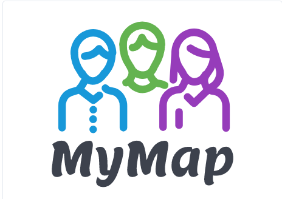
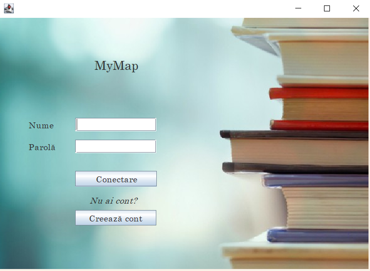
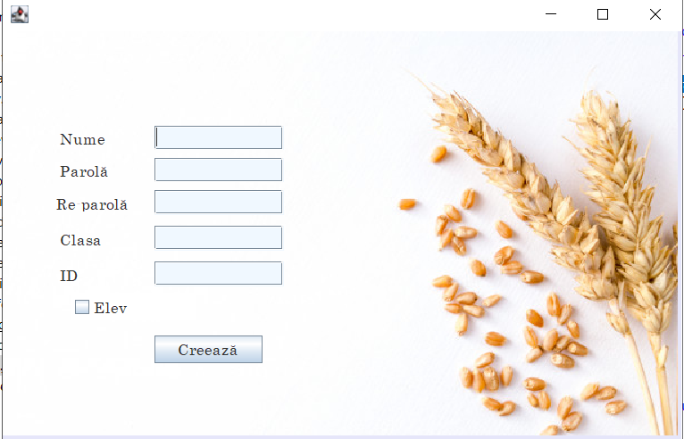
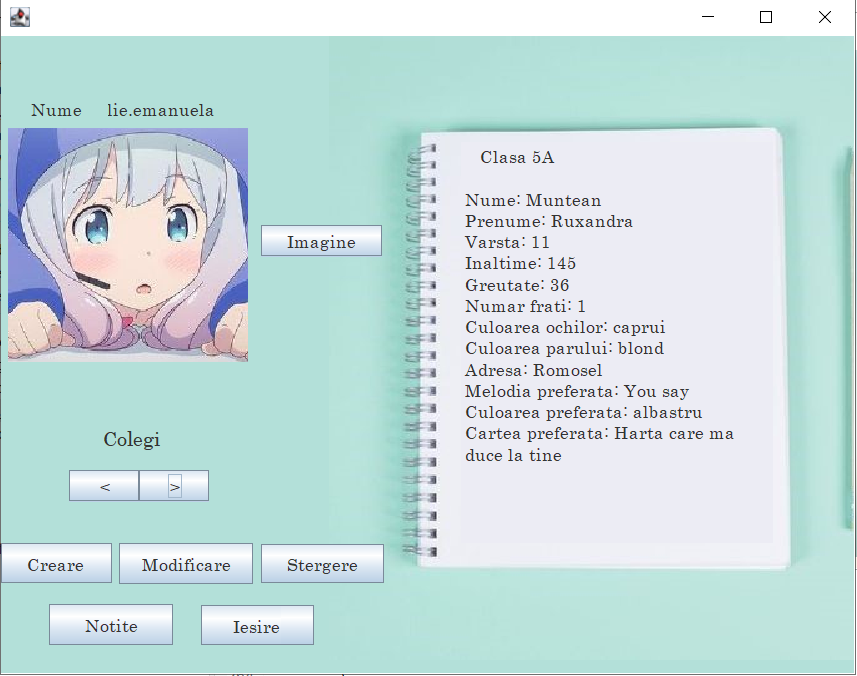
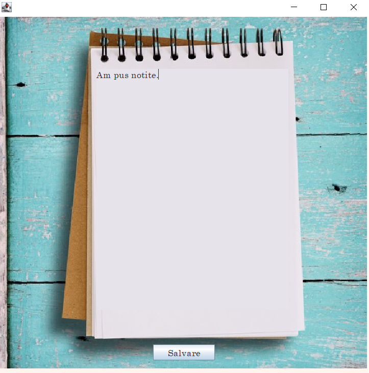
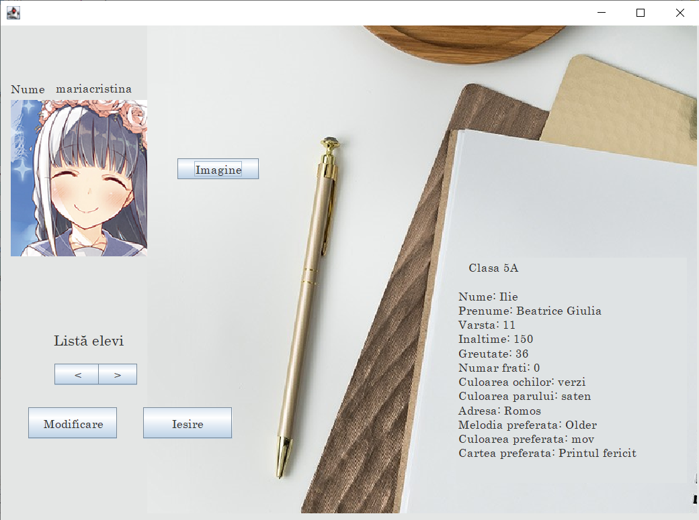

<!--
*** Thanks for checking out the Best-README-Template. If you have a suggestion
*** that would make this better, please fork the repo and create a pull request
*** or simply open an issue with the tag "enhancement".
*** Thanks again! Now go create something AMAZING! :D
-->


<!-- PROJECT SHIELDS -->
<!--
*** I'm using markdown "reference style" links for readability.
*** Reference links are enclosed in brackets [ ] instead of parentheses ( ).
*** See the bottom of this document for the declaration of the reference variables
*** for contributors-url, forks-url, etc. This is an optional, concise syntax you may use.
*** https://www.markdownguide.org/basic-syntax/#reference-style-links
-->
[![Contributors][contributors-shield]][contributors-url]
[![Forks][forks-shield]][forks-url]
[![Stargazers][stars-shield]][stars-url]
[![Issues][issues-shield]][issues-url]


<!-- PROJECT LOGO -->
<br />
<p align="center">
  <a href="https://github.com/EmanuelaIlie/MyMap">
    
  </a>

  <h3 align="center">MyMap</h3>

  <p align="center">
    Desktop application for teachers and students
    <br />
    <a href="https://github.com/EmanuelaIlie/MyMap"><strong>Explore the docs »</strong></a>
    <br />
    <br />
    ·
    <a href="https://github.com/EmanuelaIlie/MyMap/issues">Report Bug</a>
    ·
    <a href="https://github.com/EmanuelaIlie/MyMap/issues">Request Feature</a>
  </p>
</p>


<!-- TABLE OF CONTENTS -->
<details open="open">
  <summary>Table of Contents</summary>
  <ol>
    <li>
      <a href="#about-the-project">About The Project</a>
      <ul>
        <li><a href="#built-with">Built With</a></li>
      </ul>
    </li>
    <li>
      <a href="#getting-started">Getting Started</a>
      <ul>
        <li><a href="#prerequisites">Prerequisites</a></li>
        <li><a href="#installation">Installation</a></li>
      </ul>
    </li>
    <li><a href="#usage">Usage</a></li>
    <li><a href="#contributing">Contributing</a></li>
    <li><a href="#contact">Contact</a></li>
    <li><a href="#acknowledgements">Acknowledgements</a></li>
  </ol>
</details>


<!-- ABOUT THE PROJECT -->
## About The Project

MyMap is a desktop application for teachers and Middle School
students. Like student user, you can make your "map", where you write
personal data(age, weight, height, hobbies, etc), you can see information
about classmates and you can manage your information. Like teacher
user, you can see information about students by classes and you can
manage all information. This was my project for Individual Project
module.

### Built With

* [Eclipse](https://www.eclipse.org/)
* [Swing](https://www.javatpoint.com/java-swing)
* [MySQL](https://www.mysql.com/)


<!-- GETTING STARTED -->
## Getting Started

To get a local copy up and running follow these simple example steps.

### Prerequisites

* Eclipse
  You can download it here: https://www.eclipse.org/downloads/packages/release/kepler/sr1/eclipse-ide-java-developers

### Installation

You just Clone the repo
   ```sh
   git clone (https://github.com/EmanuelaIlie/MyMap.git)
   ```

<!-- USAGE EXAMPLES -->
## Usage

Here i will post some screenshots to ilustrate how the app works.

1. Login screen

<a href="https://github.com/EmanuelaIlie/MyMap">
    
  </a>

2. Easy registration

<a href="https://github.com/EmanuelaIlie/MyMap">
    
  </a>

3. After login, student's profile

<a href="https://github.com/EmanuelaIlie/MyMap">
    
  </a>

4. Create notes

<a href="https://github.com/EmanuelaIlie/MyMap">
    
  </a>

5. Edit/add information

<a href="https://github.com/EmanuelaIlie/MyMap">
    
  </a>

6. After login, teacher's profile

<a href="https://github.com/EmanuelaIlie/MyMap">
    
  </a>
                    

<!-- CONTRIBUTING -->
## Contributing

Contributions are what make the open source community such an amazing place to be learn, inspire, and create. Any contributions you make are **greatly appreciated**.

1. Fork the Project
2. Create your Feature Branch (`git checkout -b feature/AmazingFeature`)
3. Commit your Changes (`git commit -m 'Add some AmazingFeature'`)
4. Push to the Branch (`git push origin feature/AmazingFeature`)
5. Open a Pull Request


<!-- CONTACT -->
## Contact

Ilie Emanuela-Maria - [emanuela.ilie99@e-uvt.ro](emanuela.ilie99@e-uvt.ro)

Project Link: [https://github.com/EmanuelaIlie/MyMap](https://github.com/EmanuelaIlie/MyMap)


<!-- ACKNOWLEDGEMENTS -->
## Acknowledgements
* [icons8](https://icons8.com/icons/set/android)
* [GitHub Pages](https://pages.github.com)


<!-- MARKDOWN LINKS & IMAGES -->
<!-- https://www.markdownguide.org/basic-syntax/#reference-style-links -->
[contributors-shield]: https://img.shields.io/github/contributors/EmanuelaIlie/MyMap.svg?style=for-the-badge
[contributors-url]: https://github.com/EmanuelaIlie/MyMap/graphs/contributors
[forks-shield]: https://img.shields.io/github/forks/EmanuelaIlie/MyMap.svg?style=for-the-badge
[forks-url]: https://github.com/EmanuelaIlie/MyMap/network/members
[stars-shield]: https://img.shields.io/github/stars/EmanuelaIlie/MyMap.svg?style=for-the-badge
[stars-url]: https://github.com/EmanuelaIlie/MyMap/stargazers
[issues-shield]: https://img.shields.io/github/issues/EmanuelaIlie/MyMap.svg?style=for-the-badge
[issues-url]: https://github.com/EmanuelaIlie/MyMap/issues
